# Django SP Admin

[](https://www.djangoproject.com/)
[](https://www.python.org/)
[](https://tailwindcss.com/)
[](LICENSE)

A sleek, modern Django admin interface override with Tailwind CSS styling, dark mode support, and responsive design. Built on the [Starting Point UI](https://www.startingpointui.com/) design system.

---

## ✨ Features

🎨 **Modern UI** - Clean, responsive design built with Tailwind CSS for a contemporary look and feel that reduces admin fatigue and improves usability across all Django admin interfaces.

🌙 **Dark Mode** - Built-in dark mode toggle with seamless switching, perfect for working in low-light environments and reducing eye strain during extended admin sessions.

🔍 **Enhanced Admin** - Tabular inlines, advanced filters, powerful search capabilities, and customizable form displays that make data management intuitive and efficient.

📱 **Fully Responsive** - Works perfectly on all devices from mobile phones to large desktop screens, ensuring administrators can manage their Django applications from anywhere.

---

## 📸 Screenshots

### Landing Page
The landing page provides an intuitive introduction to the Django SP Admin interface with a clean, modern design. The light theme features a bright, welcoming aesthetic, while the dark mode variant maintains full visibility and comfort for extended use.

#### Light mode
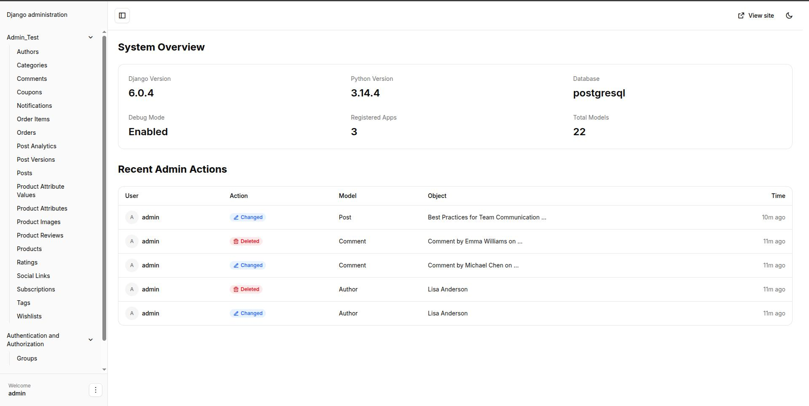

#### Dark mode
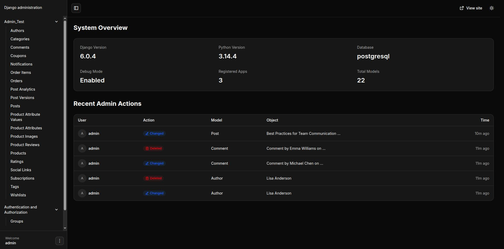

### Admin List View
The admin list view displays your data in a clean, organized table format with powerful filtering and search capabilities. Both light and dark themes maintain excellent readability and visual hierarchy, making it easy to scan and manage large datasets efficiently.

#### Light mode
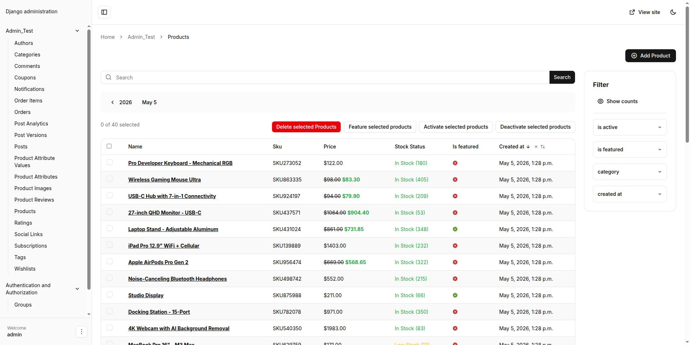

#### Dark mode
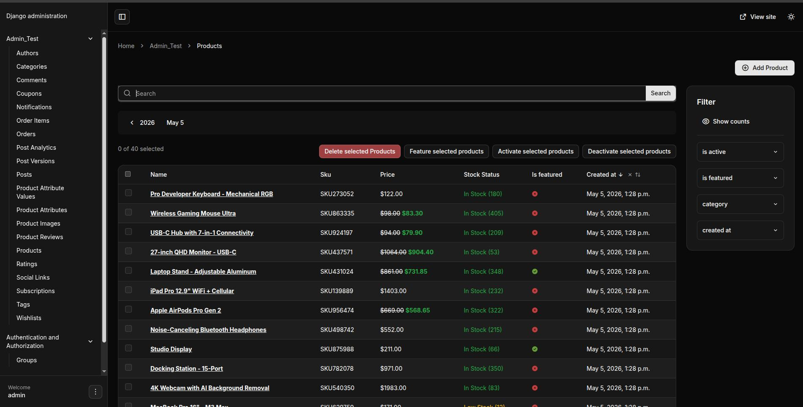

### Login
A clean, minimalist login page that maintains the modern design language of Django SP Admin.

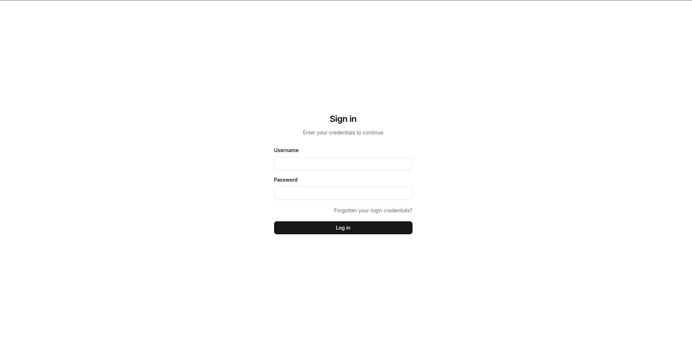

### Form Elements & Features
Enhanced form controls provide intuitive interfaces for complex data entry. The following specialized components make working with different data types efficient and user-friendly:

#### Foreign Key Selection
Streamlined dropdown and selection interface for managing relationships between models

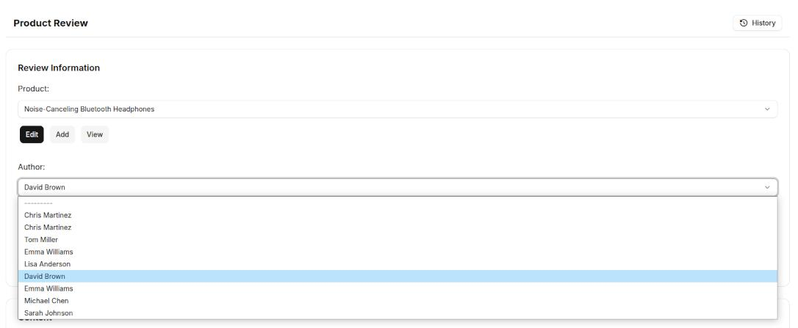

#### Multi-Select
Select multiple related objects with ease using an intuitive multi-select component

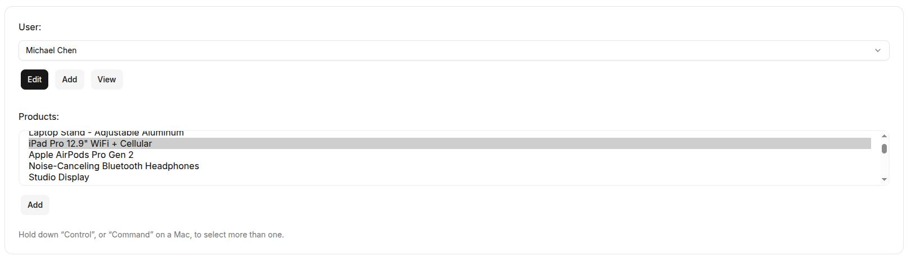

#### Date Picker
Beautiful calendar-based date selection.

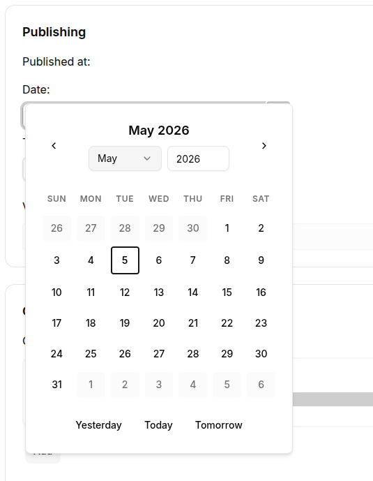

#### Time Picker
Precise time input with visual controls for hours and minutes.

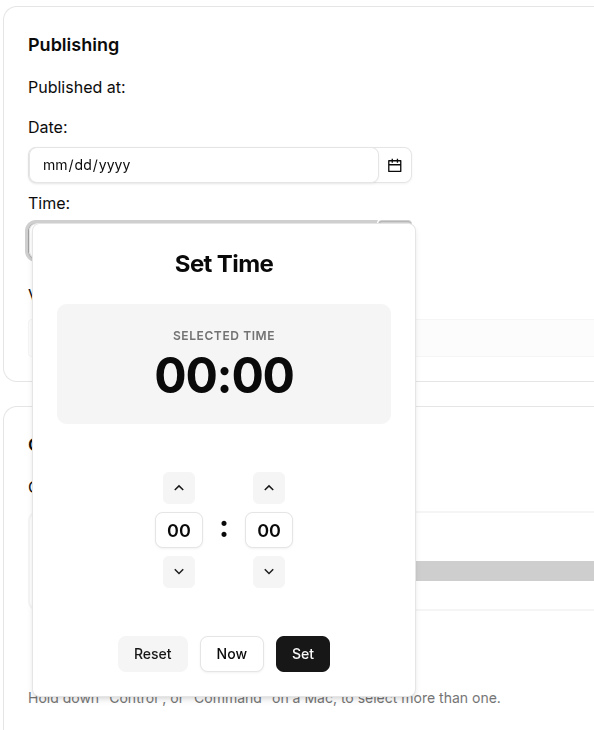

### Inline Display Options
Flexible inline editing options allow you to manage related objects directly within the parent object's form, reducing context switching and improving workflow efficiency.

#### Inline Stack Format
Vertical stack layout for inline objects, ideal for forms with limited horizontal space

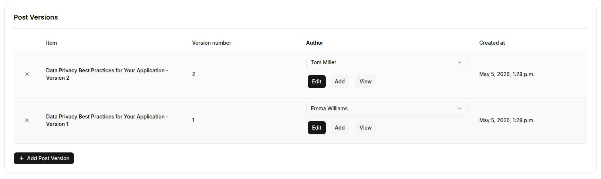

#### Inline Tabular Format
Table-based layout for inline objects, perfect for managing multiple related items in a spreadsheet-like interface

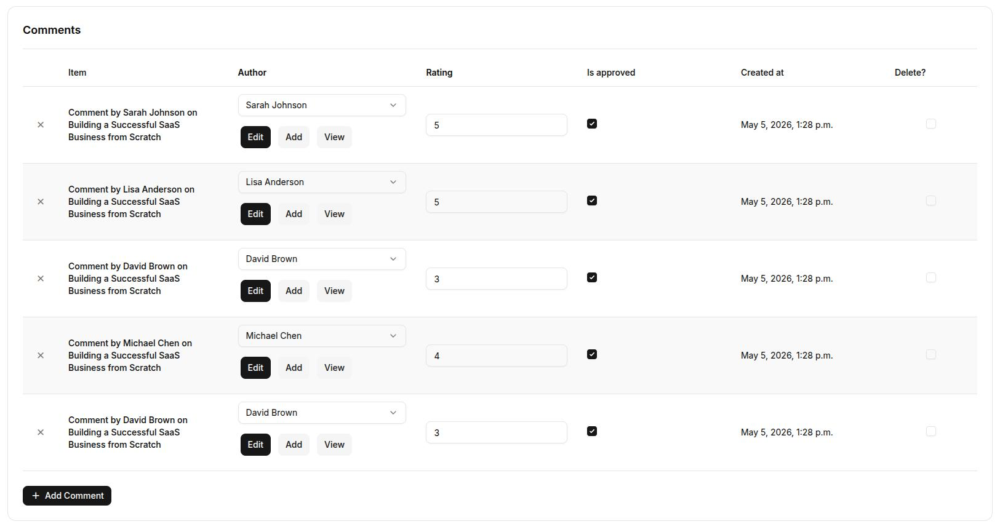

### Additional Features
#### Media Management

Integrated media library for uploading, organizing, and managing images and files with a visual preview interface and intelligent file browser.

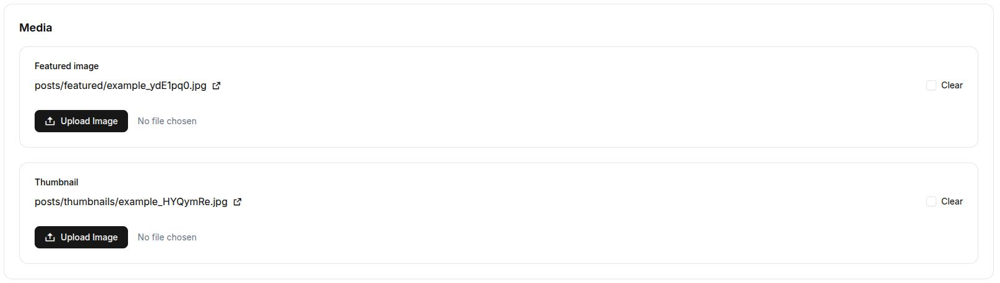

---

## 🚀 Quick Start

This project includes a Dev Container configuration for consistent development environments.

### Prerequisites
- [VS Code](https://code.visualstudio.com/)
- [Remote - Containers extension](https://marketplace.visualstudio.com/items?itemName=ms-vscode-remote.remote-containers)
- [Docker](https://www.docker.com/)

### Getting Started with Dev Container

1. **Open the project in VS Code**
   ```bash
   code .
   ```

2. **Reopen in Container**
   - When prompted, click "Reopen in Container"
   - Or press `Ctrl+Shift+P` (or `Cmd+Shift+P` on Mac) and select "Remote-Containers: Reopen in Container"

3. **Install dependencies and run the development server**
    ```bash
    # Install dependencies
    uv sync

    # load dummy data
    uv load_dummy_data

    # Create superuser
    uv run manage.py createsuperuser

    # Run development server
    uv run manage.py tailwind runserver
    ```

The dev container automatically handles all dependencies and configuration, providing a fully isolated development environment.

Visit [http://localhost:8000/admin](http://localhost:8000/admin) and log in.


## License

MIT License - see [LICENSE](LICENSE) for details.


## Contributing

Contributions welcome! Please submit pull requests or open issues.
